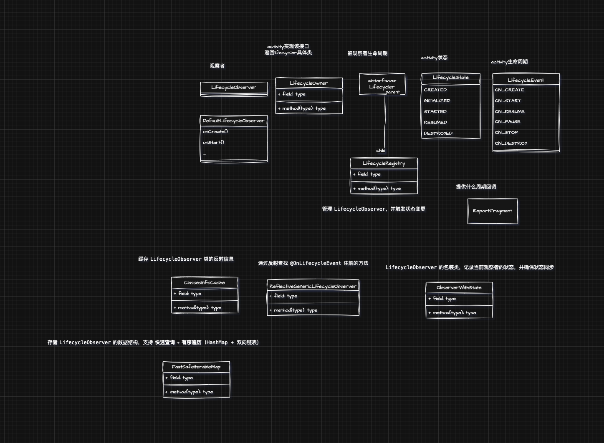

# lifecycle原理

##### 为什么需要lifecycle

很多工具类需要知道界面的生命周期，就比如播放器，播放器需要在界面可见的时候才播放，不可见的时候暂停，在界面销毁的时候，销毁播放器

> 弊端：
> 
> - 每个界面都需要在对应的生命周期调用，开发成本变大
> 
> - 手动管理，容易漏调用方法，导致内存泄露
> 
> 优点：上面的反过来就是了

##### 怎么解决上面的问题

怎么解决上面的问题，怎么感知宿主的生命周期（Activity/Fragment），并且回调给工具类

可以想到一种设计模式，观察者模式 

观察者模式也分为推和拉的模式，java内置有实现，这里不讨论。

看传统的是怎么实现的

###### 观察者

```java
// 观察者接口，所有观察者都必须实现
interface Observer {
    void update(String method);
}
```

###### 被观察者

```java
// 被观察者接口，支持添加、移除观察者，并通知所有观察者
interface Subject {
    void addObserver(Observer observer);
    void removeObserver(Observer observer);
    void notifyObservers(String message);
}
```

###### 被观察者的具体实现

```java
import java.util.ArrayList;
import java.util.List;

class Publisher implements Subject {
    private List<Observer> observers = new ArrayList<>();

    @Override
    public void addObserver(Observer observer) {
        observers.add(observer);
    }

    @Override
    public void removeObserver(Observer observer) {
        observers.remove(observer);
    }

    @Override
    public void notifyObservers(String method) {
        for (Observer observer : observers) {
            observer.update(method);
        }
    }


    public void publish(String method) {
        System.out.println("方法改变: " + news);
        notifyObservers(method);
    }
}
```

基于上面的模式

**工具类**实现观察者接口

工具类**宿主**实现被观察者

如果是我们自己写的，工具类判断method做不同的操作就可以了，而宿主（Activity/Fragment）只要实现了Publisher的方法，并且在不同的生命周期调用publish传入不同的方法名就可以实现类似lifecycler的功能了，就是这么简单

###### 看android的是怎么实现的

观察者

```java
public interface LifecycleObserver {

}
```

被观察者

可以看到这里就多了个Event和State，其他没啥区别了

```java
public abstract class Lifecycle {


    @RestrictTo(RestrictTo.Scope.LIBRARY_GROUP)
    @NonNull
    AtomicReference<Object> mInternalScopeRef = new AtomicReference<>();

    @MainThread
    public abstract void addObserver(@NonNull LifecycleObserver observer);


    @MainThread
    public abstract void removeObserver(@NonNull LifecycleObserver observer);


    @MainThread
    @NonNull
    public abstract State getCurrentState();

    @SuppressWarnings("WeakerAccess")
    public enum Event {

        ON_CREATE,

        ON_START,

        ON_RESUME,

        ON_PAUSE,

        ON_STOP,

        ON_DESTROY,

        ON_ANY;


        @Nullable
        public static Event downFrom(@NonNull State state) {
            switch (state) {
                case CREATED:
                    return ON_DESTROY;
                case STARTED:
                    return ON_STOP;
                case RESUMED:
                    return ON_PAUSE;
                default:
                    return null;
            }
        }


        @Nullable
        public static Event downTo(@NonNull State state) {
            switch (state) {
                case DESTROYED:
                    return ON_DESTROY;
                case CREATED:
                    return ON_STOP;
                case STARTED:
                    return ON_PAUSE;
                default:
                    return null;
            }
        }


        @Nullable
        public static Event upFrom(@NonNull State state) {
            switch (state) {
                case INITIALIZED:
                    return ON_CREATE;
                case CREATED:
                    return ON_START;
                case STARTED:
                    return ON_RESUME;
                default:
                    return null;
            }
        }

        @Nullable
        public static Event upTo(@NonNull State state) {
            switch (state) {
                case CREATED:
                    return ON_CREATE;
                case STARTED:
                    return ON_START;
                case RESUMED:
                    return ON_RESUME;
                default:
                    return null;
            }
        }

        @NonNull
        public State getTargetState() {
            switch (this) {
                case ON_CREATE:
                case ON_STOP:
                    return State.CREATED;
                case ON_START:
                case ON_PAUSE:
                    return State.STARTED;
                case ON_RESUME:
                    return State.RESUMED;
                case ON_DESTROY:
                    return State.DESTROYED;
                case ON_ANY:
                    break;
            }
            throw new IllegalArgumentException(this + " has no target state");
        }
    }


    @SuppressWarnings("WeakerAccess")
    public enum State {

        DESTROYED,


        INITIALIZED,

        CREATED,

        STARTED,

        RESUMED;


        public boolean isAtLeast(@NonNull State state) {
            return compareTo(state) >= 0;
        }
    }
}
```

android里面的activity和fragment没有直接实现Lifecycle，而是引入了LifecycleOwner。让activity和fragment实现这个接口，并且返回了一个Lifecycle

```java
public interface LifecycleOwner {

    @NonNull
    Lifecycle getLifecycle();
}
```

这样做的好处是什么，达到解耦效果，是符合下面这几条原则的

| **设计原则**        |                                                     |
| --------------- | --------------------------------------------------- |
| **单一职责原则（SRP）** | `Activity` 只负责 UI 逻辑，生命周期管理交给 `Lifecycle`。          |
| **开闭原则（OCP）**   | 通过 `LifecycleObserver` 扩展生命周期逻辑，而不修改 `Activity` 代码。 |
| **依赖倒置原则（DIP）** | `Activity` 依赖 `Lifecycle` 抽象，而不是具体实现，符合依赖倒置原则。x     |

```java
ComponentActivity
//实现了
LifecycleOwner
//重写了方法
   @NonNull
    @Override
    public Lifecycle getLifecycle() {
        return mLifecycleRegistry;
    }
   //返回这个对象,这个是具体的观察者
  private final LifecycleRegistry mLifecycleRegistry = new LifecycleRegistry(this);


   //oncreate中注入了一个空的fragment来进行生命周期的分发，
   //这里面区分了版本号进行分发
   //大于29直接注册activity的生命周期，在生命周期中处理，而不是在fragment中处理
   ReportFragment.injectIfNeededIn(this);


   //小于29在fragment做的事件分发
  @Override
    public void onActivityCreated(Bundle savedInstanceState) {
        super.onActivityCreated(savedInstanceState);
        dispatchCreate(mProcessListener);
        dispatch(Lifecycle.Event.ON_CREATE);
    }

    @Override
    public void onStart() {
        super.onStart();
        dispatchStart(mProcessListener);
        dispatch(Lifecycle.Event.ON_START);
    }

    @Override
    public void onResume() {
        super.onResume();
        dispatchResume(mProcessListener);
        dispatch(Lifecycle.Event.ON_RESUME);
    }

    @Override
    public void onPause() {
        super.onPause();
        dispatch(Lifecycle.Event.ON_PAUSE);
    }

    @Override
    public void onStop() {
        super.onStop();
        dispatch(Lifecycle.Event.ON_STOP);
    }

    @Override
    public void onDestroy() {
        super.onDestroy();
        dispatch(Lifecycle.Event.ON_DESTROY);
        mProcessListener = null;
    }

 //这个diaspatch判断了版本号，小于29才会进行分发
    private void dispatch(@NonNull Lifecycle.Event event) {
        if (Build.VERSION.SDK_INT < 29) {
            dispatch(getActivity(), event);
        }
    }


  static void dispatch(@NonNull Activity activity, @NonNull Lifecycle.Event event) {
        if (activity instanceof LifecycleRegistryOwner) {
            ((LifecycleRegistryOwner) activity).getLifecycle().handleLifecycleEvent(event);
            return;
        }
//走的是这里，activity实现了LifecyleOwner接口
        if (activity instanceof LifecycleOwner) {
            Lifecycle lifecycle = ((LifecycleOwner) activity).getLifecycle();
           //并且具体的lifecycle在
            if (lifecycle instanceof LifecycleRegistry) {
                ((LifecycleRegistry) lifecycle).handleLifecycleEvent(event);
            }
        }
    }

    public void handleLifecycleEvent(@NonNull Lifecycle.Event event) {
        enforceMainThreadIfNeeded("handleLifecycleEvent");
        moveToState(event.getTargetState());
    }

    //这里可以看的出来是通过Event返回状态，而Event就是我们fragment的对应的生命周期
    //Event（事件）：表示生命周期发生的具体事件
    //State（状态）：表示组件当前所处的生命周期状态
    //一个 Event 发生后，组件会进入一个 State，这个映射关系就是 getTargetState() 处理的
    //但是这里为何这样判断呢?这里在后面会附加描述，可以首先理解为是生命周期对应的activity当前的状态
    //activity四个状态：创建，可见但是不可交互，可交互，销毁
     @NonNull
        public State getTargetState() {
            switch (this) {
                case ON_CREATE:
                case ON_STOP:
                    return State.CREATED;
                case ON_START:
                case ON_PAUSE:
                    return State.STARTED;
                case ON_RESUME:
                    return State.RESUMED;
                case ON_DESTROY:
                    return State.DESTROYED;
                case ON_ANY:
                    break;
            }
            throw new IllegalArgumentException(this + " has no target state");
        }


    private void moveToState(State next) {
       //判断宿主状态和当前是否一致
        if (mState == next) {
            return;
        }
        //保存当前状态，
        mState = next;
        //第一个变量判断是否正在同步状态，第二个变量判断当前是否有观察者
        if (mHandlingEvent || mAddingObserverCounter != 0) {
            //这里标记了有新的事件发生
            mNewEventOccurred = true;
            // we will figure out what to do on upper level.
            return;
        }
        mHandlingEvent = true;
        sync();//这里同步
        mHandlingEvent = false;
    }


//sync() 方法是 LifecycleRegistry 用来同步 LifecycleObserver 状态的核心逻辑。
//它确保 LifecycleRegistry 内部管理的所有观察者（LifecycleObserver）的生命周期状态与 LifecycleOwner 的状态一致。
      private void sync() {
        //mLifecycleOwner弱引用持有LifecycleRegistry创建的时候传入的activity
        LifecycleOwner lifecycleOwner = mLifecycleOwner.get();
        if (lifecycleOwner == null) {
            throw new IllegalStateException("LifecycleOwner of this LifecycleRegistry is already"
                    + "garbage collected. It is too late to change lifecycle state.");
        }
        //生命周期状态同步循环：
        //isSynced() 方法检查所有观察者的状态是否已经与 LifecycleOwner 的状态一致。如果不一致，就继续同步。
        while (!isSynced()) {
            mNewEventOccurred = false;
//mObserverMap.eldest() 获取的是最早注册的观察者。mState 代表当前 LifecycleRegistry 的状态，如果 mState 比最早注册的观察者的状态小，说明有观察者的状态比 LifecycleOwner 预期的状态更高（可能是 DESTROYED 状态），需要执行 backwardPass() 进行降级
            if (mState.compareTo(mObserverMap.eldest().getValue().mState) < 0) {
                backwardPass(lifecycleOwner);
            }
//mObserverMap.newest() 获取的是最新注册的观察者。
//mState 比最新的观察者的状态大，说明有新注册的观察者需要更新到最新状态，因此执行 forwardPass() 进行升级。
//mObserverMap是hashmap+双向链表的结构，保证了 顺序性，又优化了 查询效率
            Map.Entry<LifecycleObserver, ObserverWithState> newest = mObserverMap.newest();
            if (!mNewEventOccurred && newest != null
                    && mState.compareTo(newest.getValue().mState) > 0) {
                forwardPass(lifecycleOwner);
            }
        }
//mNewEventOccurred 用来检测是否有新的生命周期事件发生，如果 forwardPass() 或 backwardPass() 过程中 mNewEventOccurred 变成 true，说明有新的状态变化，需要继续循环，直到所有观察者同步完成。
        mNewEventOccurred = false;
    }

    private boolean isSynced() {
        if (mObserverMap.size() == 0) {
            return true;
        }
        State eldestObserverState = mObserverMap.eldest().getValue().mState;
        State newestObserverState = mObserverMap.newest().getValue().mState;
        return eldestObserverState == newestObserverState && mState == newestObserverState;
    }


 void dispatchEvent(LifecycleOwner owner, Event event) {
            State newState = event.getTargetState();
            mState = min(mState, newState);
            //这里进行什么周期的回调
            mLifecycleObserver.onStateChanged(owner, event);
            mState = newState;
        }
```

要理解这个Event和State的映射关系，我们来看 **Android 生命周期的状态转换**：

| **事件（Event）** | **导致的状态（State）**                      |
| ------------- | ------------------------------------- |
| `ON_CREATE`   | `CREATED`                             |
| `ON_STOP`     | `CREATED`（从 `STARTED` 或 `RESUMED` 退回） |
| `ON_START`    | `STARTED`                             |
| `ON_PAUSE`    | `STARTED`（从 `RESUMED` 退回）             |
| `ON_RESUME`   | `RESUMED`                             |
| `ON_DESTROY`  | `DESTROYED                            |

- ON_CREATE 和 ON_STOP → CREATED
  ON_CREATE 发生后，Activity 进入 CREATED 状态，但还没有 ON_START，所以它还不能与用户交互。
  ON_STOP 发生后，Activity 进入后台，变回 CREATED 状态，但仍未被销毁。

- ON_START 和 ON_PAUSE → STARTED
  ON_START 发生后，Activity 进入 STARTED 状态，UI 可见但不可交互（比如锁屏时）。
  ON_PAUSE 发生时，Activity 从 RESUMED 退回 STARTED 状态，表示 UI 仍可见但失去焦点。

- ON_RESUME → RESUMED
  ON_RESUME 发生后，Activity 进入 RESUMED 状态，用户可以交互。

- ON_DESTROY → DESTROYED
  ON_DESTROY 发生后，Activity 进入 DESTROYED 状态，不再可用。

- `Lifecycle.Event` **表示生命周期的事件**，`Lifecycle.State` **表示生命周期的状态**。

- `getTargetState()` **用于确定 Event 发生后，Lifecycle 组件应该处于哪个 State**。

- 这个转换遵循 Android 生命周期的设计原则，确保 `LifecycleOwner` 的状态管理正确

添加观察者

```java
getLifecycle().addObserver(vapUtil);


 @Override
    public void addObserver(@NonNull LifecycleObserver observer) {
      //LifecycleObserver 只能在主线程 被添加，避免多线程导致 mObserverMap 并发修改的问题
        enforceMainThreadIfNeeded("addObserver");
       //初始化状态，确保新观察者不会进入比 LifecycleRegistry 还高的生命周期状态
        State initialState = mState == DESTROYED ? DESTROYED : INITIALIZED;
       //包裹状态和观察者,并且通过反射+注解解析里面的方法
        ObserverWithState statefulObserver = new ObserverWithState(observer, initialState);
        ObserverWithState previous = mObserverMap.putIfAbsent(observer, statefulObserver);
       //防止多次添加同一个对象的情况下会重复执行下面的逻辑
        if (previous != null) {
            return;
        }
        LifecycleOwner lifecycleOwner = mLifecycleOwner.get();
        if (lifecycleOwner == null) {
            // it is null we should be destroyed. Fallback quickly
            return;
        }
//mAddingObserverCounter 记录 当前是否在 addObserver() 调用过程中
//mHandlingEvent 记录 当前是否正在处理生命周期事件
//如果 isReentrance == true，说明 addObserver() 过程中有可能导致新的 addObserver() 触发
//如果 isReentrance == false，就需要 sync() 来同步状态
        boolean isReentrance = mAddingObserverCounter != 0 || mHandlingEvent;
        State targetState = calculateTargetState(observer);
        mAddingObserverCounter++;
//while 循环的核心逻辑：
//calculateTargetState(observer) 计算 observer 需要到达的状态（比如 STARTED 或 RESUMED）。
//如果 observer 的当前状态 mState 小于 targetState，就继续推进：
//通过 Event.upFrom(statefulObserver.mState) 计算 下一个事件
//触发 statefulObserver.dispatchEvent(lifecycleOwner, event) 让 observer 逐步进入目标状态
//重新计算 targetState，防止 LifecycleRegistry 状态发生变更导致目标状态更新
//pushParentState(statefulObserver.mState) 记录当前状态，防止递归调用状态丢失。
//popParentState() 处理状态恢复，确保 sync() 运行时状态不会异常。

        while ((statefulObserver.mState.compareTo(targetState) < 0
                && mObserverMap.contains(observer))) {
            pushParentState(statefulObserver.mState);
            final Event event = Event.upFrom(statefulObserver.mState);
            if (event == null) {
                throw new IllegalStateException("no event up from " + statefulObserver.mState);
            }
            statefulObserver.dispatchEvent(lifecycleOwner, event);
            popParentState();
            // mState / subling may have been changed recalculate
            targetState = calculateTargetState(observer);
        }

        if (!isReentrance) {
            // we do sync only on the top level.
            sync();
        }
        mAddingObserverCounter--;
    }
```

android 系统的和自己的比较，多了很多判断，细节性的处理，并且基于面向对象的原则做了很多class，考虑的点更多

- 观察者模式

- 面向对象原则

- 拓展性

- 如何实现快速查找和增删

- 更多的安全性检测

涉及到的类


