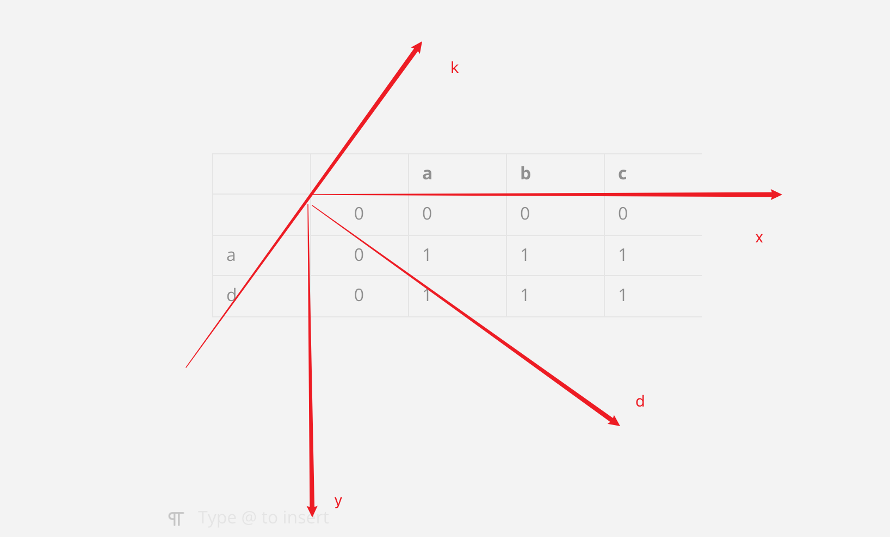
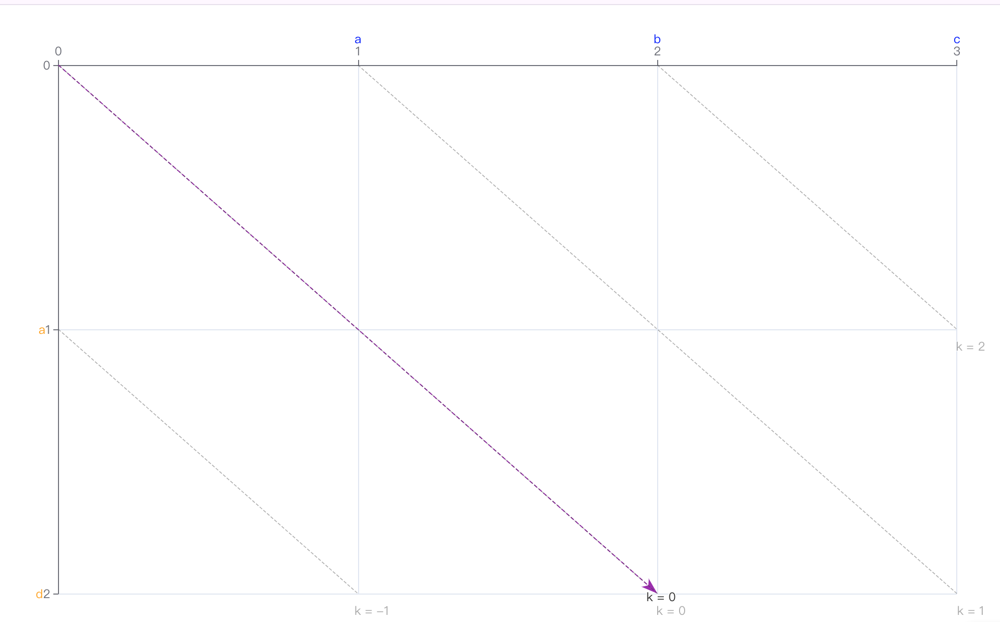
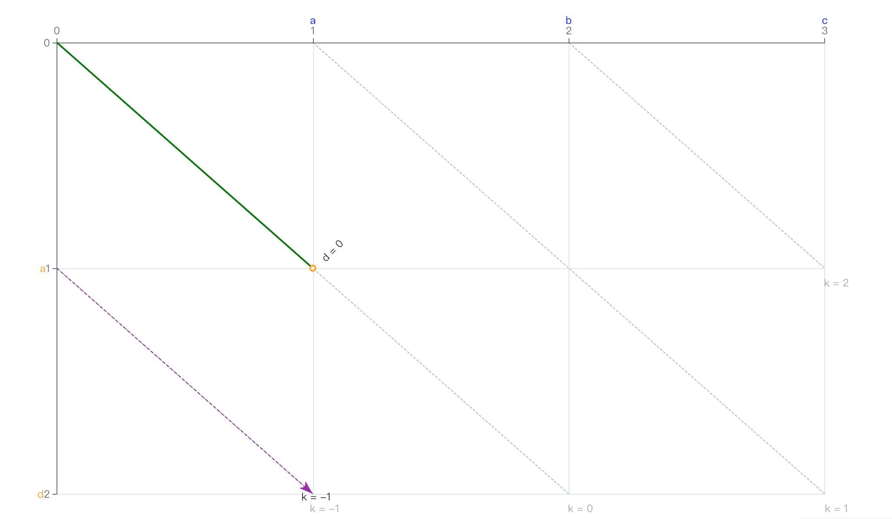
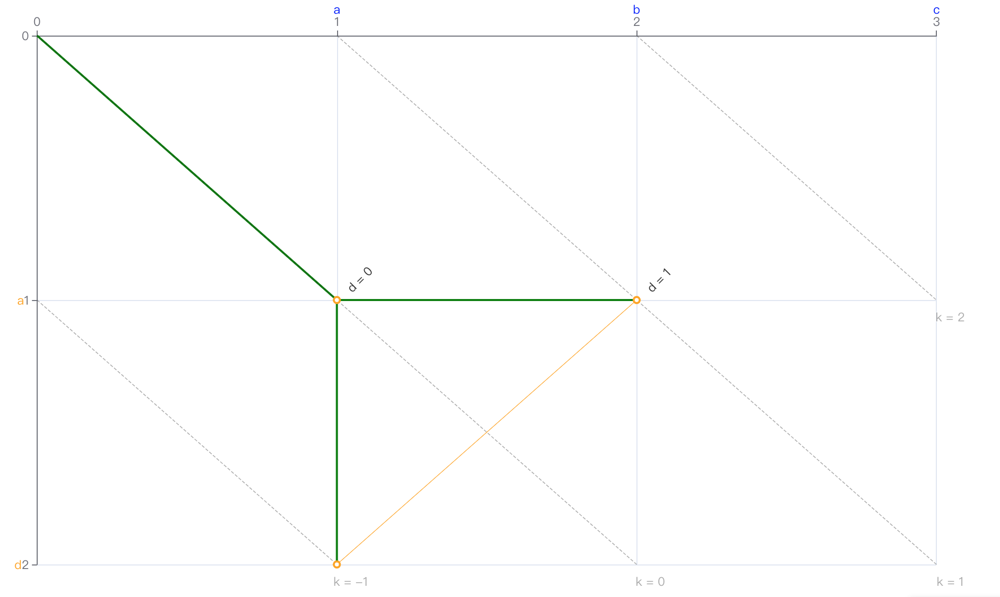
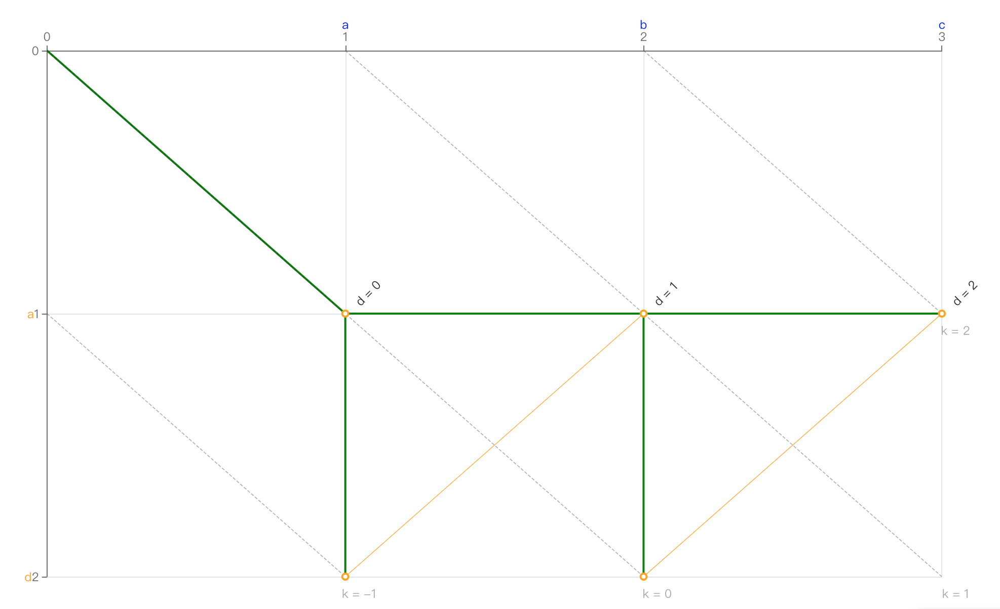
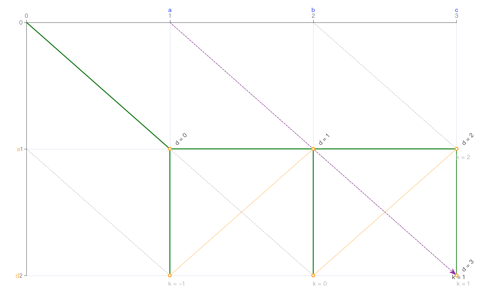

# myers算法白话文

为什么叫**myers**算法，因为这个算法是**迈尔斯**发表的，

具体发表内容看这里

[myers算法](http://www.xmailserver.org/diff2.pdf)

# 什么是差分

什么是差分：就是找差异的意思，比如字符串"abccc"和”bbcac“的差异

对于这两个字符串，如果让你找出相同的地方,很简单，因为这两个字符串太简单，人脑处理起来挺快的，有主观能动性。在程序中怎么实现这样一个功能呢？

程序是按规则执行的，所以你要把你人脑中怎么找出相同的部分的逻辑用代码实现出来。

而myers算法差不多做的就是这样一个事情，找相同和找不同，并且能做到回溯

myers实则是把大问题，分解为小问题，然后求得小问题推导出大问题的结果

# 最大公共子序列

什么是最大公子序列：比如字符串"abccc"和”bbcac“，那么最大公共子序列长度是3，字符串是bcc

既然要找到两个字符串相同的部分，所以得对比里面每个字符串是否相等

我这里画的图都是左优先级，有的博客的图是上优先级先的【意思就是左边和上边相等，先继承那边的】

|     |     | a   | b   | c   | c   | c   |
| --- |:---:| --- | --- | --- | --- | --- |
|     | x   | x   | x   | x   | x   | x   |
| b   | x   | 0   | 1   | 0   | 0   | 0   |
| b   | x   | 0   | 1   | 0   | 0   | 0   |
| c   | x   | 0   | 0   | 1   | 1   | 1   |
| a   | x   | 1   | 0   | 0   | 0   | 0   |
| c   | x   | 0   | 0   | 1   | 1   | 1   |

这样一个表格，就是把我们大问题转换为小问题

但是这样一个表格无法让我们知道最大公共子序列是啥?,这个表格得改造才行

这个表格实则做的工作是两个for循环，比较是否相等，所以得改造这个表格，如果对比相等的话，得拿到之前相等的次数+1，如果不相等，要继承上一次的长度才行.

但是由于是两次for循环了，会导致每个字符都比较一次，但是有的字符用完了就不能继续用了，所以这个相等的时候也不是简单的次数+1就行

比如 aa和aa对比，如果简单+1就会出现

|     |     | a   | a   |
| --- |:---:| --- | --- |
|     | 0   | 0   | 0   |
| a   | 0   | 1   | 1   |
| a   | 0   | 1   | 1   |

那么这里所有都+1就会导致是4，实则是2才对
那么怎么过滤掉之前已经匹配的呢，实则就是拿左上角的次数+1才对，因为a1和a1对比过了，后续的a2和a1对比得拿左上角的次数+1，所以应该如下图，为什么下面有一列都为0和一行都为0，目的是说明，和空字符串对比那么都为0。并且可以处理相等情况，最大公共子序列长度 = [列数-1][行数-1]+1防止超出下标的情况

|     |     | a   | a   |
| --- |:---:| --- | --- |
|     | 0   | 0   | 0   |
| a   | 0   | 1   | 1   |
| a   | 0   | 1   | 2   |

最长公共子序列长度2

|     |     | a   | b   | c   | c   | c   |
| --- |:---:| --- | --- | --- | --- | --- |
|     | 0   | 0   | 0   | 0   | 0   | 0   |
| b   | 0   | 0   | 1   | 1   | 1   | 1   |
| b   | 0   | 0   | 1   | 1   | 1   | 1   |
| c   | 0   | 0   | 1   | 2   | 2   | 2   |
| a   | 0   | 1   | 1   | 2   | 2   | 2   |
| c   | 0   | 1   | 1   | 2   | 3   | 3   |

最长公共子序列3

最长公共子序列的长度就是右下角的长度，但是日常中我们更多的是拿最长公共子序列的内容，而不单单是长度

# 最长公共子序列回溯

怎么回溯到之前的最长公共子序列，既然要回溯，那么肯定跟之前找到最长公共子序列的规则有关：回顾一下

**相等找左上角的次数+1，不相等对比左边和上边，相同找最大**

那么如何回溯呢，看着这个图，相同那么就左上角加1，既然相同那么这个值必定是输入需要记录的方位的，不相等是继承左边或者上边的。那么我这里标记一下这个路径，左上角保持来的。回溯路径，右下角开始，我这里标记为√

下面这条就是回溯的路径

|     |     | a   | b   | c   | c   | c   |
| --- |:---:| --- | --- | --- | --- | --- |
|     | 0√  | 0   | 0   | 0   | 0   | 0   |
| b   | 0√  | 0√  | 1   | 1   | 1   | 1   |
| b   | 0   | 0   | 1√  | 1   | 1   | 1   |
| c   | 0   | 0   | 1   | 2√  | 2   | 2   |
| a   | 0   | 1   | 1   | 2√  | 2√  | 2   |
| c   | 0   | 1   | 1   | 2   | 3   | 3√  |

回溯如下

对路径中向左上角遍历的起始位置进行标记为★

|     |     | a   | b   | c   | c   | c   |
| --- |:---:| --- | --- | --- | --- | --- |
|     | 0√  | 0   | 0   | 0   | 0   | 0   |
| b   | 0√  | 0√  | 1   | 1   | 1   | 1   |
| b   | 0   | 0   | 1★  | 1   | 1   | 1   |
| c   | 0   | 0   | 1   | 2★  | 2   | 2   |
| a   | 0   | 1   | 1   | 2√  | 2√  | 2   |
| c   | 0   | 1   | 1   | 2   | 3   | 3★  |

** 因为根据规则里面，左上角+1得来的就是相同的 **

# 代码实现

```java
public class LCS {

    // 计算LCS长度[最长公共子序列长度]
    public static int lcsLength(String text1, String text2) {
        int m = text1.length(), n = text2.length();
        int[][] dp = new int[m+1][n+1];

        for (int i=1; i<=m; i++) {
            for (int j=1; j<=n; j++) {
                if (text1.charAt(i-1) == text2.charAt(j-1)) {
                    dp[i][j] = dp[i-1][j-1] + 1;  // 对角线延伸
                } else {
                    dp[i][j] = Math.max(dp[i-1][j], dp[i][j-1]); // 取最大值
                }
            }
        }
        return dp[m][n];
    }

    // 回溯LCS字符串【回溯，找到最长公共子序列的字符串】
    public static String backtrackLCS(String text1, String text2) {
        int m = text1.length(), n = text2.length();
        int[][] dp = new int[m+1][n+1];

        // 填充DP矩阵
        for (int i=1; i<=m; i++) {
            for (int j=1; j<=n; j++) {
                if (text1.charAt(i-1) == text2.charAt(j-1)) {
                    dp[i][j] = dp[i-1][j-1] + 1;
                } else {
                    dp[i][j] = Math.max(dp[i-1][j], dp[i][j-1]);
                }
            }
        }

        // 逆向追踪路径
        StringBuilder lcs = new StringBuilder();
        int i = m, j = n;
        while (i > 0 && j > 0) {
            if (text1.charAt(i-1) == text2.charAt(j-1)) {
                lcs.append(text1.charAt(i-1));  // 收集匹配字符[8](@ref)
                i--;
                j--;
            } else if (dp[i-1][j] > dp[i][j-1]) {
                i--; // 向上移动
            } else {
                j--; // 向左移动[7](@ref)
            }
        }
        return lcs.reverse().toString(); // 反转得到正确顺序
    }
}
```

# 最小编辑距离

如果只是做增删的情况下，那么可以知道
相同的部分不需要做操作，不同的部分做增加或者删除的操作，大不了就是删除然后增加
每个操作的代价为1的情况下

```java
med(A,B)=length(A)+length(B)-2*lcs(A,B)
```

比如上面的就是
5+5-2*3 = 4步，就可以从abccc转换为bbcac

根据上面的表可以知道路径，那么这个路径怎么找到最短编辑距离，想一想
肯定也是根据上面规则来处理的

> 相等的情况下左上角+1，不相等的情况下继承左边和上边
> 
> 根据这个，继承来的都是不相等的，左上角+1来的都是相等的

那么这里我们把向左遍历的标记为→，想上遍历的标记为↑

|     |     | a   | b   | c   | c   | c   |
| --- |:---:| --- | --- | --- | --- | --- |
|     | 0√  | 0   | 0   | 0   | 0   | 0   |
| b   | 0√↑ | 0√→ | 1   | 1   | 1   | 1   |
| b   | 0   | 0   | 1★√ | 1   | 1   | 1   |
| c   | 0   | 0   | 1   | 2★√ | 2   | 2   |
| a   | 0   | 1   | 1   | 2√↑ | 2√→ | 2   |
| c   | 0   | 1   | 1   | 2   | 3   | 3★√ |

那么这里看到可以知道，abccc想变成bbcac，

> → 的位置，表示在路径中删除原始字符串对应的字符
> ↑  的位置，表示在路径中插入目标字符串对应的字符
> ★得表示一样，不用任何操作

增加b，删除a，增加a，删除c即可

那么为啥从上边来的是增加，左边来的是删除。按之前的规则，我们只是知道这个字符不等而已。自己根据上面的图找找规律

横轴：表示的是原字符串

竖轴：表示的新字符串。

首先需要知道，从上边继承和左边继承的意义是啥，

两个for循环

```java
for(int or = 1;or<=original.lenght();or++){
    for(int tar = 1;tar<=target.lenght();tar++){

    } 
}
```

这样的对比流程是怎么样的，

- 先拿原字符串中的第1个值和新字符串都对比一遍，生成第一行

- 再拿原字符串中的第2个值和新字符串都对比一遍，生成第二行

- 再拿原字符串中的第3个值和新字符串都对比一遍，生成第三行

从上边继承来的表示，一直没有匹配到新字符串中的值，所以新增一个可以理解吧

从左边过来的，表示之前有匹配到的新的值，所以删除原字符串中的值可以理解吧

# 代码实现

最小编辑距离

```java
public class EditDistance {

    public static int minEditDistance(String word1, String word2) {
        int m = word1.length(), n = word2.length();
        int[][] dp = new int[m+1][n+1];

        // 初始化边界条件
        for (int i=0; i<=m; i++) dp[i][0] = i; //
        for (int j=0; j<=n; j++) dp[0][j] = j; //

        for (int i=1; i<=m; i++) {
            for (int j=1; j<=n; j++) {
                if (word1.charAt(i-1) == word2.charAt(j-1)) {
                    dp[i][j] = dp[i-1][j-1]; // 字符匹配无需操作
                } else {
                    //int replace = dp[i-1][j-1] + 1; // 替换操作,这里不使用替换
                    int delete = dp[i-1][j] + 1;    // 删除操作
                    int insert = dp[i][j-1] + 1;     // 插入操作
                    //dp[i][j] = Math.min(replace, Math.min(delete, insert)); // 取最小
                    dp[i][j] =  Math.min(delete, insert); // 取最小值
                }
            }
        }
        return dp[m][n];
    }
}
```

打印

```java
public class MinEditDistanceWithSteps {
    private static final int INSERT_COST = 1;
    private static final int DELETE_COST = 1;
    private static final int REPLACE_COST = 1;

    public static void printEditSteps(String source, String target) {
        int m = source.length();
        int n = target.length();
        int[][] dp = new int[m+1][n+1];
        String[][] operations = new String[m+1][n+1];

        // 初始化边界条件
        for (int i = 0; i <= m; i++) {
            dp[i][0] = i * DELETE_COST;
            operations[i][0] = "删除 '" + (i>0 ? source.charAt(i-1) : "") + "'";
        }
        for (int j = 0; j <= n; j++) {
            dp[0][j] = j * INSERT_COST;
            operations[0][j] = "插入 '" + (j>0 ? target.charAt(j-1) : "") + "'";
        }

        // 填充DP矩阵并记录操作路径
        for (int i = 1; i <= m; i++) {
            for (int j = 1; j <= n; j++) {
                if (source.charAt(i-1) == target.charAt(j-1)) {
                    dp[i][j] = dp[i-1][j-1];
                    operations[i][j] = "保留 '" + source.charAt(i-1) + "'";
                } else {
                    int insert = dp[i][j-1] + INSERT_COST;
                    int delete = dp[i-1][j] + DELETE_COST;
                    int replace = dp[i-1][j-1] + REPLACE_COST;

                    dp[i][j] = Math.min(Math.min(insert, delete), replace);

                    if (dp[i][j] == replace) {
                        operations[i][j] = "替换 '" + source.charAt(i-1) + "' -> '" + target.charAt(j-1) + "'";
                    } else if (dp[i][j] == delete) {
                        operations[i][j] = "删除 '" + source.charAt(i-1) + "'";
                    } else {
                        operations[i][j] = "插入 '" + target.charAt(j-1) + "'";
                    }
                }
            }
        }

        // 回溯操作路径
        System.out.println("最小编辑距离：" + dp[m][n]);
        System.out.println("操作步骤：");
        printOperations(operations, m, n);
    }

    private static void printOperations(String[][] ops, int i, int j) {
        Stack<String> steps = new Stack<>();
        while (i > 0 || j > 0) {
            String op = ops[i][j];
            steps.push(op);

            if (op.startsWith("保留") || op.startsWith("替换")) {
                i--;
                j--;
            } else if (op.startsWith("删除")) {
                i--;
            } else {
                j--;
            }
        }

        int stepNum = 1;
        while (!steps.isEmpty()) {
            System.out.println("步骤" + stepNum++ + ": " + steps.pop());
        }
    }

    public static void main(String[] args) {
        String source = "horse";
        String target = "ros";
        printEditSteps(source, target);
    }
}
```

# myers算法

[GitHub - G-haoyu/MyerView: Myers Diff Algorithm HTML Visual Version](https://github.com/G-haoyu/MyerView)

|     |     | a   | b   | c   |
| --- |:---:| --- | --- | --- |
|     | 0   | 0   | 0   | 0   |
| a   | 0   | 1   | 1   | 1   |
| d   | 0   | 1   | 1   | 1   |

为了方便计算，myers中定义了一个k-d轴



假设旧字符串是 `A B C`，新字符串是 `A D`。我们可以把它们的对比过程想象成一个迷宫图：纵轴（新字符串）：A D  ,横轴ABC

迷宫里的每个格子代表一个字符对比的位置。我们的目标是从左上角（0,0）走到右下角（3,2），找到最短路径。路径规则：

- ​**向右走**：删除旧字符（比如删除B或C）。
- ​**向下走**：插入新字符（比如插入D）。
- ​**对角线走**：字符匹配，不需要操作（比如A和A匹配）。

### 外层循环：数步数（深度d）

外层循环就像记录你走了多少步。每一步代表一次操作（插入或删除）。  
**示意图**：

步数d=0：起点(0,0)  
步数d=1：可能走到(1,0)或(0,1)  
步数d=2：可能走到(2,0)、(1,1)、(0,2) ，其中1,1表示一次删除一一次增加 
...  
最大步数d=5（旧字符串3字符+新字符串2字符）  

### 内层循环：在k线上“跳跃”

每走一步（d值增加1），内层循环会沿着一条“k线”跳跃检查可能的位置。
k线定义：k = x - y（x是旧字符串的位置，y是新字符串的位置）
示意图：

当d=1时，k线范围是k=-1和k=1  
→ 可能位置：(1,0)对应k=1-0=1  
→ (0,1)对应k=0-1=-1  
当d=2时，k线范围是k=-2,0,2（比d=1时向外扩展2个单位）


### 基本定义

- **遍历的方向**：仅支持三个方向，分别是 **向右**、**向下**、**右下**。

- **遍历的步长**：对于向右和向下，步长为 1。一次只能移动一格；对于右下，一次可以移动任意长度，前提是移动过程中所有坐标的 x、y 值对目标值是一样的

- **遍历的深度**：对于向右和向下，每移动一步，深度加 1；对于右下，无论移动步长为多少，深度始终加 0


### 基本概念

- **snake**: 一条snake代表走一步。例如从(0,0)->(0,1) / (0,0)->(1,0) / (0,1)->(0,2)->(2,4) 这分别为三条snake，**走对角线不计入步数**。

- **k line**: 定义 k = x - y （我们可以写成 y = x - k，是相同斜率的平行斜线组成的一个集合)

- **d contour**: 走一步算一个d


### 最佳位置

Myers 差分算法是基于贪心策略实现的，对此它定义了一个 **最佳位置** 的概念，作为贪心的基准值。在 K-D 坐标系中，同一条 K 线上，X 值越大的位置（根据 K 的值可以计算得到 Y 值），则越靠近右下角的终点


### 完整走法

#### 以旧字符串 `A B C` 到新字符串 `A D` 为例，Myers算法的走法流程及结果如下：

[可视化](https://github.com/G-haoyu/MyerView?tab=readme-ov-file)

首先，为 `k(0)` 查找所有深度为 `d0` 的最佳位置，从（0，0）出发





a和a相同，所以可以向右下角直接走，来到（1,1）位置





向右或者向下走，因为直观的路径希望是先删除再插入，所以优先记录向右分支




通过广度遍历，可以找到所有的路径，并找到图中的最短路径





### 代码

#### ​**1. 路径节点抽象类（PathNode）​**

根据之前的概念

```java
public abstract class PathNode {
    public final int x;  // 旧字符串处理位置
    public final int y;  // 新字符串处理位置
    public final PathNode prev;  // 前驱节点

    public PathNode(int x, int y, PathNode prev) {
        this.x = x;
        this.y = y;
        this.prev = prev;
    }

    // 判断是否为对角线移动（无需操作）
    public abstract boolean isSnake();
}

// 对角线节点（字符匹配）
public final class Snake extends PathNode {
    public Snake(int x, int y, PathNode prev) {
        super(x, y, prev);
    }

    @Override
    public boolean isSnake() {
        return true;
    }
}

// 差异操作节点（插入/删除）
public final class DiffNode extends PathNode {
    public DiffNode(int x, int y, PathNode prev) {
        super(x, y, prev);
    }

    @Override
    public boolean isSnake() {
        return false;
    }
}
```

#### ​**2. Myers算法主类**

```java
public class MyersDiff<T> {
    private final Equalizer<T> equalizer;  // 字符比较规则

    public MyersDiff(Equalizer<T> equalizer) {
        this.equalizer = equalizer;
    }

    // 计算差异路径，
    public PathNode buildPath(List<T> oldList, List<T> newList) {
        final int N = oldList.size(), M = newList.size();
        final int MAX = N + M + 1;
        int[] v = new int[2 * MAX + 1];  // k线的最远x坐标缓存
        List<Map<Integer, PathNode>> traces = new ArrayList<>();  // 路径记录

        // 动态规划遍历步数d，最多走max【全部删除，然后新增】
        for (int d = 0; d <= MAX; d++) {
          //MAP保存。其中 Key 是 K 值
            Map<Integer, PathNode> currentTrace = new HashMap<>();
            for (int k = -d; k <= d; k += 2) {  // k线奇偶性约束
                int x;
                boolean isDown = (k == -d || (k != d && v[k-1 + MAX] < v[k+1 + MAX]));

                if (isDown) {
                    x = v[k+1 + MAX];  // 优先向下（插入）
                } else {
                    x = v[k-1 + MAX] + 1;  // 向右（删除）
                }

                int y = x - k;
                PathNode prev = (d > 0) ? traces.get(d-1).get(isDown ? k+1 : k-1) : null;

                // 沿对角线扩展（匹配字符）
                while (x < N && y < M && equalizer.equals(oldList.get(x), newList.get(y))) {
                    prev = new Snake(x, y, prev);
                    x++; y++;
                }

                v[k + MAX] = x;
                currentTrace.put(k, (x <= N && y <= M) ? new DiffNode(x, y, prev) : prev);

                // 到达终点则终止
                if (x >= N && y >= M) {
                    return currentTrace.get(k);
                }
            }
            traces.add(currentTrace);
        }
        return null;
    }
}
```

### **二、差异生成与回溯**

#### ​**1. 差异操作解析**

```java
public List<Diff<T>> generateDiff(PathNode path, List<T> oldList, List<T> newList) {
    List<Diff<T>> diffs = new ArrayList<>();
    while (path != null && path.prev != null) {  // 从终点回溯到起点
        if (path.isSnake()) {  // 对角线移动（保留字符）
            path = path.prev;
            continue;
        }

        int prevX = path.prev.x, prevY = path.prev.y;
        if (path.x == prevX) {  // 插入新字符
            diffs.add(0, new Diff<>(DiffType.INSERT, newList.get(prevY)));
        } else if (path.y == prevY) {  // 删除旧字符
            diffs.add(0, new Diff<>(DiffType.DELETE, oldList.get(prevX)));
        }
        path = path.prev;
    }
    return diffs;
}

// 差异类型枚举
public enum DiffType { INSERT, DELETE }
public static class Diff<T> {
    public final DiffType type;
    public final T value;

    public Diff(DiffType type, T value) {
        this.type = type;
        this.value = value;
    }
}
```

### **三、算法调用示例**

#### ​**1. 字符串比对场景**

```java
// 定义字符比较规则
Equalizer<String> equalizer = (a, b) -> a.equals(b);
MyersDiff<String> myersDiff = new MyersDiff<>(equalizer);

// 旧字符串与新字符串
List<String> oldList = Arrays.asList("A", "B", "C", "A", "B", "B", "A");
List<String> newList = Arrays.asList("C", "B", "A", "B", "A", "C");

// 计算差异路径
PathNode path = myersDiff.buildPath(oldList, newList);
List<Diff<String>> diffs = generateDiff(path, oldList, newList);

// 输出结果：DELETE A, DELETE B, INSERT B, DELETE B, INSERT C
diffs.forEach(diff -> System.out.println(diff.type + " " + diff.value));
```

### **四、关键实现逻辑说明**

1. ​**k线跳跃机制**  
   通过`v`数组缓存每一步d中k线的最远x坐标，优先选择删除操作（向右移动）以符合Myers算法的直观性规则

2. ​**动态规划剪枝**  
   外层循环步数d，内层遍历k ∈ [-d, d]范围，时间复杂度优化至O(ND)

3. ​**对角线扩展优化**  
   在发现字符匹配时，沿对角线连续移动（`while`循环），减少冗余操作步数

---

### ​**五、应用场景扩展**

1. ​**代码版本对比**  
   适配Git Diff工具，解析代码行的插入/删除操作

2. ​**UI列表更新**  
   类似Android的DiffUtil，优化RecyclerView的数据更新性能

以上实现完整覆盖了Myers算法的核心逻辑，可通过调整`Equalizer`接口适配不同数据类型的差异计算需求。具体代码细节可参考GitHub开源项目中的Myers实现
